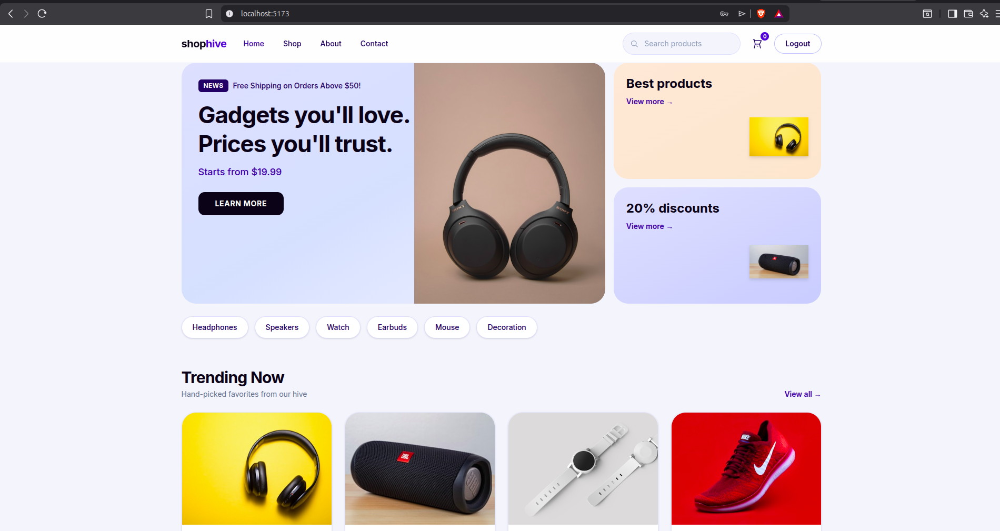
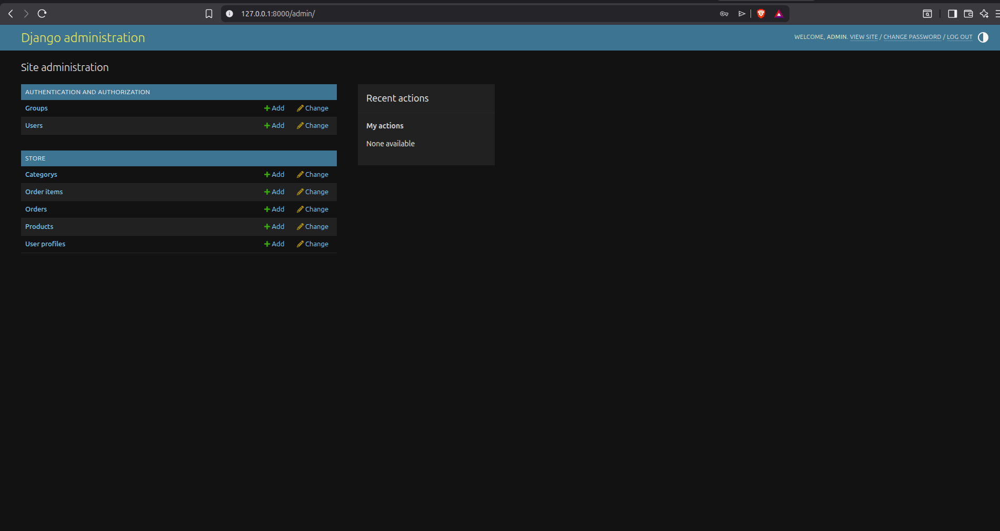

# Local Development Setup Guide

## Overview

This guide explains how to set up the ShopHive e-commerce application locally.

<table>
<tr>
<td width="50%">

## Frontend SS



</td>

<td width="50%">

## Backend SS



</td>
</tr>
</table>

### Technology Stack

| Component               | Technology            |
| ----------------------- | --------------------- |
| Frontend                | React + Vite          |
| Backend                 | Django REST Framework |
| Database                | PostgreSQL            |
| Containerization        | Docker                |
| Development Environment | Docker Compose        |

The application consists of:

```text
                Browser
                   |
                   |
             React Frontend
              (Vite :5173)
                   |
                   |
          Django REST Framework
              (:8000)
                   |
                   |
             PostgreSQL
              (:5432)
```

---

# Prerequisites

Install the following tools before starting:

- Git
- Docker
- Docker Compose
- Node.js (if running frontend manually)
- Python 3.12+ (if running backend manually)

Verify installations:

```bash
git --version
docker --version
docker compose version
```

---

# Clone Repository

Clone the project:

```bash
git clone <repository-url>

cd shophive
```

---

# Option 1: Manual Development Setup

Use this method if you want to run frontend and backend separately.

---

# Backend Setup (Django)

## Navigate to Backend

```bash
cd backend
```

---

## Create Virtual Environment

Linux/macOS:

```bash
python3 -m venv venv

source venv/bin/activate
```

Windows:

```bash
python -m venv venv

venv\Scripts\activate
```

---

## Install Dependencies

```bash
pip install -r requirements.txt
```

Additional packages if required:

```bash
pip install djangorestframework-simplejwt requests
```

---

## Environment Configuration

Create `.env`:

```bash
vim .env
```

Example:

```env
DB_NAME=ecommerce_db
DB_USER=ecommerce_user
DB_PASSWORD=yourpassword
DB_HOST=localhost
DB_PORT=5432
```

---

# PostgreSQL Setup

Using Docker:

```bash
docker run -d \
  --name postgres \
  -e POSTGRES_DB=ecommerce_db \
  -e POSTGRES_USER=ecommerce_user \
  -e POSTGRES_PASSWORD=yourpassword \
  -p 5432:5432 \
  postgres:15
```

Verify:

```bash
docker ps
```

---

# Django Database Setup

Run migrations:

```bash
python manage.py migrate
```

Create admin user:

```bash
python manage.py createsuperuser
```

Collect static files:

```bash
python manage.py collectstatic --noinput
```

---

# Load Sample Data (Optional)

To populate products and categories:

```bash
python seed.py
```

---

# Start Django Server

Development mode:

```bash
python manage.py runserver
```

or expose it to the network:

```bash
python manage.py runserver 0.0.0.0:8000
```

Backend will be available:

```
http://localhost:8000
```

---

# Frontend Setup (React + Vite)

Navigate:

```bash
cd frontend
```

---

## Install Dependencies

```bash
npm install
```

---

## Environment Configuration

Create `.env`:

```bash
vim .env
```

Add:

```env
VITE_DJANGO_BASE_URL=http://localhost:8000
```

---

## Start Development Server

```bash
npm run dev
```

Frontend will be available:

```
http://localhost:5173
```

---

# Option 2: Run Using Docker Compose (Recommended)

Docker Compose provides a consistent development environment.

## Start Services

From the project root:

```bash
docker compose up --build
```

This starts:

| Service        | Port |
| -------------- | ---- |
| React Frontend | 5173 |
| Django Backend | 8000 |
| PostgreSQL     | 5432 |

---

## Stop Services

```bash
docker compose down
```

---

## View Logs

All services:

```bash
docker compose logs -f
```

Backend only:

```bash
docker compose logs -f backend
```

Frontend only:

```bash
docker compose logs -f frontend
```

---

# Application URLs

| Service      | URL                          |
| ------------ | ---------------------------- |
| Frontend     | http://localhost:5173        |
| Django Admin | http://localhost:8000/admin/ |
| REST API     | http://localhost:8000/api/   |

---

# Common Commands

## Rebuild Containers

```bash
docker compose up --build
```

---

## Remove Containers

```bash
docker compose down
```

---

## Remove Containers and Volumes

Warning: This removes database data.

```bash
docker compose down -v
```

---

## Access Django Container Shell

```bash
docker compose exec backend bash
```

---

## Access Database

```bash
docker compose exec postgres psql -U ecommerce_user ecommerce_db
```

---

# Troubleshooting

## Port Already in Use

Check running services:

```bash
sudo lsof -i :8000
```

Stop conflicting process:

```bash
kill <PID>
```

---

## Database Connection Error

Verify PostgreSQL container:

```bash
docker ps
```

Check environment variables:

```env
DB_HOST=postgres
DB_PORT=5432
```

When using Docker Compose, the database hostname should be the service name.

---

## Frontend Cannot Connect to Backend

Check:

```env
VITE_DJANGO_BASE_URL=http://localhost:8000
```

Ensure Django allows frontend origin in CORS settings.

---

# Development Workflow

Recommended workflow:

```text
Pull latest changes
        |
        |
Create feature branch
        |
        |
Run Docker Compose
        |
        |
Develop and test
        |
        |
Commit changes
        |
        |
Push branch
        |
        |
Create Pull Request
```

---
